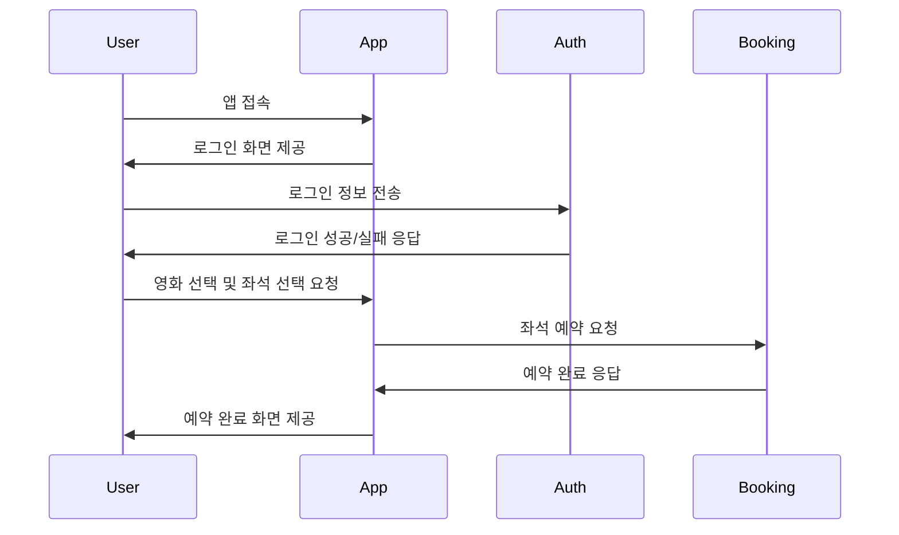

# 🎬 영화 예매 앱 시뮬레이션 (Flask 기반)

## ✅ 개요
영화 예매 앱의 일상적인 사용 시나리오를 시퀀스 다이어그램으로 모델링하고, 이를 기반으로 실제 동작하는 샘플 코드를 Flask로 구현했습니다.  
사용자는 로그인 후 영화 좌석을 선택하고 예약할 수 있습니다.

---

## 📌 구성 파일

| 파일명             | 설명                             |
|--------------------|----------------------------------|
| `app.py`           | 메인 Flask 앱 실행 파일           |
| `auth.py`          | 사용자 로그인 처리                |
| `booking.py`       | 좌석 예약 처리                    |
| `requirements.txt` | 필요한 라이브러리 (Flask 등) 목록 |
| `README.md`        | 프로젝트 설명 문서                |

---
## 📝 시퀀스 다이어그램 (Mermaid)

---

## 🧑‍💻 샘플 코드 설명 및 📊 모듈 평가

| 모듈명        | 역할                     | 응집도                     | 결합도                        |
|---------------|--------------------------|-----------------------------|-------------------------------|
| `app.py`      | 앱 실행 및 라우팅 관리    | 중간 – 여러 기능 연결 역할   | 낮음 – 모듈 간 느슨한 결합     |
| `auth.py`     | 사용자 로그인 및 인증 처리 | 높음 – 인증 기능에 집중       | 낮음 – 독립적으로 설계됨       |
| `booking.py`  | 좌석 선택 및 예약 처리     | 높음 – 예약 기능에 집중       | 낮음 – 다른 모듈과 최소 의존성 |
